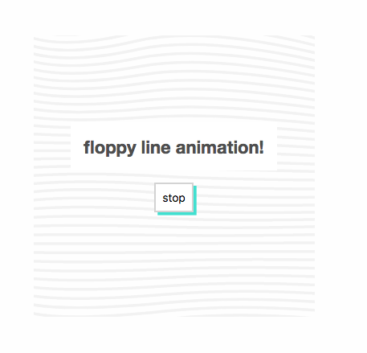

SVG PATH ANIMATION: Randomized SVG paths without Greensock
------------

See it live [here](https://jmsoper.github.io/svg-path-animation/)

This is a demo of how to animate SVG paths using JavaScript.

A much better way to do so is just to use the Greensock plugin, `morphSVG` but since that can only be used without a license inside of CodePen, I thought I'd see how hard it was to make my own (much simpler, less powerful) version.

It ended up really being an exploration in all the ways I can commit reference errors, but it helped me to think about how animations get built together, and how to think of motion in a step-by-step sense. In reality, there isn't really a good reason (that I can think of) why this shouldn't be in canvas, and there are a host of reasons why it should. 

Applications moving forward (or ideas for you to tinker with and try for yourself!):

1. What if, instead of generating random waves to have continous motion, the lines were at rest until the cursor interacted with them? For example, a cursor moving over the box could displace lines, dragging the curves after it, or click could open up a space between the lines.

2. What's a way to make this code easier to read and more reusable?

3. How could we incorporate color in this? We can't use gradients in SVG paths (apart from brute-force simulating them) but what if this was in canvas? What if we created a sense of 3D space by dictating color by how far above or below the median each point was on each line?

4. ...Now how would we do this the right way with GreenSock? 

Made by [Glitch](https://glitch.com/)
-------------------

\ ゜o゜)ノ
